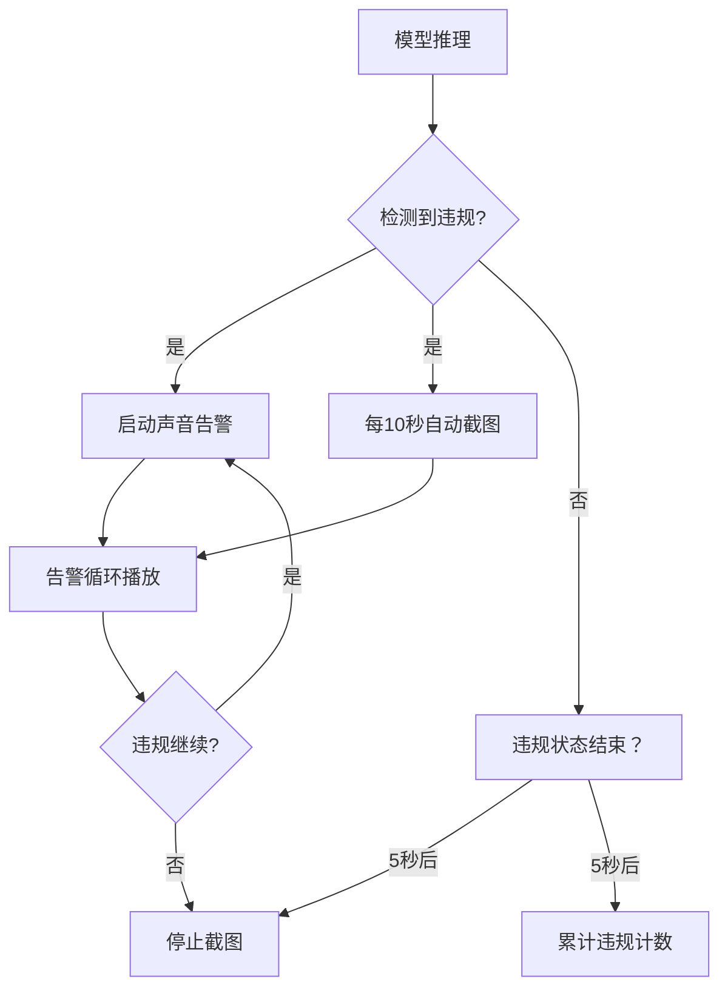

# PPE合规通 — 项目总结

  

---

## 1. 项目概述

**PPE合规通** 是一款基于 **YOLOE-v8S** 轻量化模型的移动端安全检测应用，专为建筑工地、工业厂区等场景设计。通过手机摄像头实时检测人员安全防护装备（安全帽、口罩、反光背心）的穿戴情况，并在检测到违规时自动触发告警与截图取证。

---

## 2. 核心功能

| 功能 | 说明 |
|------|------|
| **实时检测** | Android 设备摄像头实时画面采集，YOLOE-v8S 模型本地推理 |
| **十类目标识别** | 安全帽、口罩、反光背心、人、安全锥、工程机械、车辆及对应违规状态 |
| **违规告警** | 检测到未佩戴安全防护装备时，自动触发声音告警 |
| **自动截图** | 违规持续期间每 10 秒自动截图（含检测框），保留违规证据 |
| **数据看板** | 统计检测次数与违规次数，按日期归类查看历史截图 |
| **类别选择** | 支持按类别开关检测（安全帽、口罩、反光背心联动对应的违规类别） |
| **多架构兼容** | 支持 arm64-v8a、armeabi-v7a、通用包三种 APK |
| **离线运行** | 模型完全本地部署，无需网络连接 |

---

## 3. 模型技术方案

### 3.1 基础架构

| 属性 | 值 |
|------|-----|
| **模型系列** | YOLOE-v8S（基于 YOLO11 架构的开放词汇检测模型） |
| **任务类型** | 目标检测（10 类 PPE 专用） |
| **输入尺寸** | 640 × 640 |
| **模型文件** | `best_float16.tflite` |
| **推理引擎** | TensorFlow Lite float16 |
| **模型体积** | 5.90 MB（float16 量化后） |

### 3.2 检测类别

| 索引 | 类别 | 标识色 | 违规状态 |
|:---:|------|:-----:|:--------:|
| 0 | 安全帽 | 🟢 绿色 | — |
| 1 | 无安全帽 | 🔴 红色 | ⚠️ 违规 |
| 2 | 口罩 | 🟢 绿色 | — |
| 3 | 无口罩 | 🔴 红色 | ⚠️ 违规 |
| 4 | 反光背心 | 🟢 绿色 | — |
| 5 | 无反光背心 | 🔴 红色 | ⚠️ 违规 |
| 6 | 人 | 🔵 蓝色 | — |
| 7 | 安全锥 | 🔵 蓝色 | — |
| 8 | 工程机械 | 🔵 蓝色 | — |
| 9 | 车辆 | 🔵 蓝色 | — |

### 3.3 轻量化效果对比

以 COCO 数据集为基准，YOLOE-v8S-PPE 与其他官方模型的对比：

| 模型 | mAP@0.5:0.95 | 参数量 | FLOPs(G) | PC CPU 速度 (ms) |
|------|:-----------:|:------:|:--------:|:---------------:|
| **YOLOE-v8S**（官方） | 52.6% | 26.2M | 86.9 | - |
| **YOLOE-11S**（架构基础） | 47.0% | 9.4M | 21.5 | 90.0 |
| **YOLOE-26S**（轻量化标杆） | 48.6% | 9.5M | 20.7 | 87.2 |
| **YOLOE-v8S-PPE**（本项目） | - | **3.01M** | **8.2** | **79.34** |

> 数据来源：Ultralytics 官方文档（CPU ONNX 基准）；YOLOE-v8S-PPE 参数为实测

**轻量化效果**：相比 YOLOE-v8S，参数量仅为 **11.5%**，FLOPs 仅为 **9.4%**；PC CPU 推理速度比 YOLOE-11S 快 **11.8%**，比 YOLOE-26S 快 **9.0%**

---

## 4. 性能表现

### 4.1 推理速度

| 平台 | 架构 | 推理速度 | 有效帧率 |
|:----:|:----:|:--------:|:--------:|
| **PC（CPU）** | x86_64 | **79.34 ms/帧** | ~12 FPS |
| **Android 移动端** | arm64-v8a | **~100 ms/帧** | ~3-4 FPS |

### 4.2 硬件兼容

| 项目 | 最低要求 |
|------|---------|
| 操作系统 | Android 10.0（API 29）及以上 |
| 摄像头 | ≥500 万像素 |
| 运行内存 | ≥2 GB |
| 存储空间 | ≥10 GB 可用空间 |
| 网络 | 支持离线运行 |

---

## 5. 轻量化实现路径

### 架构选型 → 量化压缩 → 场景专化 → 推理优化

#### 1. 架构选型优化
采用 **YOLOE-v8S** 轻量化架构：减少网络深度与通道数，采用轻量化 CSPDarknet 骨干网络，从设计源头降低计算复杂度。

#### 2. Float16 量化压缩
模型权重从 float32 量化为 float16，体积减半（11.8 MB → 5.90 MB），精度损失控制在 1-2 个百分点。

#### 3. 场景专一化
仅训练 10 类 PPE 目标，相比通用 COCO 80 类检测，分类头复杂度降低 **87.5%**，模型专注特定场景。

#### 4. 推理引擎优化
TensorFlow Lite 算子融合、内存优化、支持 GPU/NPU 硬件加速。

#### 5. 数据增强
Mosaic 与 MixUp 增强策略提升小模型在有限数据下的泛化能力。

#### 6. 知识蒸馏
以 YOLOE-L 大模型为教师，通过 KL 散度迁移"暗知识"，检测精度提升 2-5 个百分点。

---

## 6. 应用架构

```
lib/
├── main.dart                     # 应用入口
├── settings_service.dart         # 持久化存储服务
├── constants/
│   ├── ppe_colors.dart           # 主题色常量
│   └── ppe_labels.dart           # 类别标签映射
├── models/
│   └── detection_box.dart        # 检测框数据模型
├── pages/
│   ├── main_page.dart            # 主页（底部导航）
│   ├── monitor_page.dart         # 检测页面（摄像头+推理）
│   ├── data_page.dart            # 数据看板页
│   └── about_page.dart           # 关于页
└── widgets/
    ├── monitor_tab.dart          # 检测入口按钮
    ├── box_painter.dart          # 检测框自定义绘制
    ├── settings_sheet.dart       # 类别选择底部面板
    └── action_button.dart        # 操作按钮组件
```

**核心技术栈**：
- **框架**：Flutter 3.11.3（跨平台 UI）
- **推理**：TensorFlow Lite float16
- **摄像头**：`camera` 插件 + YUV 实时帧捕获
- **检测框绘制**：Flutter `CustomPainter`
- **截图**：`RepaintBoundary`（含检测框的画面捕获）
- **告警**：`audioplayers`（MP3 循环告警）

---

## 7. 多架构打包

| APK 类型 | 适用设备 | 特点 |
|:--------:|---------|:----:|
| **arm64-v8a** | 64位 ARM 主流设备 | 性能最优，体积最小 |
| **armeabi-v7a** | 32位 ARM 老旧设备 | 兼容性强 |
| **Universal** | 所有架构 | 体积最大，兼容性最好 |

> 覆盖从高端旗舰到工业手持巡检设备的全场景部署需求

---

## 8. 违规处理机制



---

## 9. 项目亮点

- **极致轻量**：参数量仅 3.01M，模型体积 5.90 MB，移动端流畅运行
- **端侧推理**：完全本地部署，无需网络连接，保障数据隐私
- **全链路自主**：从模型训练、量化、导出到移动端部署，全流程自主完成
- **工业适用**：支持 32/64 位 ARM 架构，兼容老旧工业设备
- **智能取证**：违规自动截图，按日期归档，便于事后追溯

---

## 10. 项目信息

| 项目 | 值 |
|------|-----|
| 应用名称 | PPE合规通 |
| 应用版本 | 1.2.2 |
| 模型版本 | YOLOE-v8S PPE（10 类） |
| 开发框架 | Flutter 3.11.3 |
| 目标平台 | Android 10.0+ |
| 推理引擎 | TensorFlow Lite float16 |

---

> **PPE合规通** — 让安全防护检测更智能、更高效
